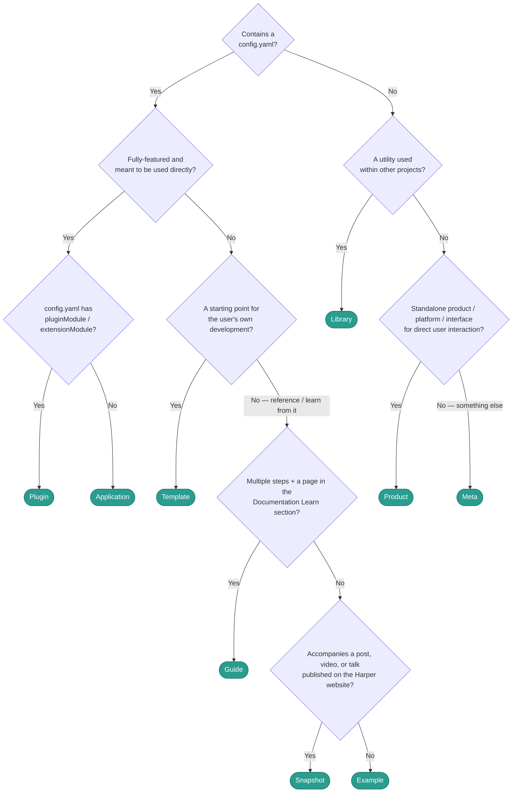

# Harper Public Repository Taxonomy

Every **public** repository gets **exactly one type**. The type establishes a baseline maintenance contract: versioning, upgrades, testing, etc.

These types do not apply to Harper's internal and private repositories; a separate taxonomy system available privately for Harper engineers.

The types defined here feed the [public repository policy](repository-policy.md), which sets what every active public repo must commit to.

> This taxonomy may not be perfect and could change over time. Refinement is expected. If you have something that doesn't cleanly fit, or you see a new classification pattern please share and help improve the system!

## Types

| Type | Definition | Examples | Upgrade Commitment | Testing Strategy |
|------|------------|----------|--------------|---------------|
| **Product** | A standalone project users directly interact with | `harper`, `harper-pro`, `studio`, `documentation`, `create-harper`, `symphony`, `skills` | Independent or tracks latest Harper | Unit/Integration/E2E + Matrix of supported runtimes |
| **Library** | Engineered on and used as a dependency | `rocksdb-js`, `integration-testing`, `extended-iterable`, `structon` | Independent or tracks latest Harper | Unit test is usually sufficient; sometimes integration tests too |
| **Plugin** | Harper Plugins; extends Harper functionality | `nextjs`, `astro`, `vite`, `oauth`, `http-cache`, `http-router`, `prerender-plugin`, `acl-connect` | Tracks latest Harper | Integration tests |
| **Application** | Runs on Harper; a deployable, feature-complete first-party app | `status-check`, `image-optimizer`, `risk-query` | Tracks latest Harper | Integration/E2E with Harper latest |
| **Template** | Build from it — a starting point you modify | `harper-ecommerce-template`, `fastify-template`, `template-redirector` | Tracks latest Harper | Smoke/Integration/E2E tests with Harper latest |
| **Example** | Read from it — a worked pattern you study and adapt | `agent-example-harper`, `full-page-caching`, `nextjs-example` | Tracks latest Harper | Integration/E2E with Harper latest |
| **Guide** | Follow it — an example plus narrated Learn content (start → build → end) | `create-your-first-application`, `caching-guide-example` | Tracks latest Harper | Integration/E2E of the final state with Harper latest |
| **Snapshot** | Companion app, example, or benchmark to a blog post, talk, or video | `twilio-sms`, `kafka-v-harper-perf-test` | Frozen | Optional, vs its pinned Harper version only |
| **Meta** | Public, but supports the org rather than being consumed as a product | `.github`, `code-guidelines`, `ai-review-prompts`, `rocksdb-prebuilds`, `github-app` | Independent | Independent |

### Classification Decision Tree

Follow this decision tree to assist with classifying active, public repositories.

## Products

The catch-all for standalone, user-facing projects that aren't a plugin, application, or library — from the platform itself down to developer-facing tools like `create-harper`. If users interact with it directly and it doesn't fit a more specific type, it's a product.

`harper` is the product that defines the Harper version; every other type's version commitment is measured against it. Products are either independently versioned (own release cadence) or track latest Harper.

**Upgrades & testing.** Whether it versions independently or tracks Harper, a product should be validated against the latest and upcoming Harper versions as early as possible — ideally as a pre-release step — so a new Harper release never silently breaks it. Testing is the full stack: unit, integration, and e2e across a matrix of supported runtimes.

## Plugins

A literal Harper [Plugin](https://docs.harperdb.io/reference/v5/components/overview#plugins) or [Extension](https://docs.harperdb.io/reference/v5/components/overview#extensions) component — code that extends the Harper runtime and is installed into a Harper instance. The giveaway is a `config.yaml` declaring `pluginModule:` or `extensionModule:` — including extensions slated to migrate to the plugin API.

Plugins track latest Harper, moving in lockstep with the runtime API they extend.

**Upgrades & testing.** Plugins should be upgraded and tested against the latest and upcoming Harper versions as early as possible — ideally as a pre-release step. Integration tests against the latest Harper are the baseline.

## Applications

A literal Harper [Application](https://docs.harperdb.io/reference/v5/components/applications) component — a feature-complete, deployable first-party app that runs on Harper. Like a plugin it has a `config.yaml`, but *without* `pluginModule`/`extensionModule`, and it is meant to be used directly rather than to extend the runtime.

The line against Template is completeness: an application works as-is (perhaps with light configuration); a template is a starting point you build from.

**Upgrades & testing.** Applications track latest Harper: upgraded and tested against the latest and upcoming Harper versions as early as possible — ideally as a pre-release step. Integration/e2e against the latest Harper are the baseline.

## Libraries

Code you build *with* — imported as a dependency rather than run. Reserve this for true dependencies (`rocksdb-js`, `integration-testing`, `extended-iterable`).

Contrast: a library is imported, an application is run, a product is interacted with. Libraries are either independently versioned or track latest Harper.

**Upgrades & testing.** Test against the latest and upcoming Harper versions as early as possible, or as a pre-release step. Unit tests are usually sufficient; add integration tests as necessary.

## Templates

A starting point users copy and modify into their own project. Two tiers:

- **Generic** — opinion-light getting-started scaffold; lives in `create-harper`; smoke-tested.
- **Advanced** — complex, domain-specific starting point, non/partially-functional until modified / configured (e.g. `template-markdown-prerender`); lives standalone; integration or e2e tested.

Complexity doesn't make a template an example — the contract (build-from vs read-from) decides, not size.

**Upgrades & testing.** Templates track latest Harper: upgraded and tested against the latest and upcoming Harper versions as early as possible. Test depth follows the tier — smoke for generic, integration or e2e for advanced.

## Examples

A complete, worked pattern users read and adapt — reference material, not necessarily something to fork and build on (thought they could). It's functional and tested, but its purpose is to be studied.

Contrast: a template is built *from*, an example is read *from*, and a guide adds step-by-step narration.

**Upgrades & testing.** Examples track latest Harper: upgraded and tested against the latest and upcoming Harper versions as early as possible. Integration/e2e on the pattern.

## Guides

An example paired with narrated Learn content that walks start → build → end, backing a canonical page in the Documentation Learn section.

A guide is living and tracks latest Harper — that's the line against Snapshot, which freezes to a dated artifact (see [Guide vs Snapshot](#guide-vs-snapshot)).

**Upgrades & testing.** Guides track latest Harper: upgraded and tested against the latest and upcoming Harper versions as early as possible. Integration/e2e on the guide's final state.

## Snapshots

A frozen companion to a dated artifact — a blog post, talk, video, or benchmark. Pinned to the Harper version it was built against and never upgraded.

**Upgrades & testing.** None — a snapshot is never upgraded. Any tests run only against its pinned Harper version.

- **Frozen but open** during its major's life: content untouched, issues/PRs stay enabled for bug fixes.
- **Archived when the next Harper major goes GA.** Read-only, not deleted — stays referenceable.
- Going red on a *future* major is expected, not a failure.
- A frequently-referenced Snapshot can be **promoted** to a maintained Example/Template.

### Guide vs Snapshot

> **A dated artifact never references a living repo. living ↔ living, frozen ↔ frozen.**

- **Guide** backs canonical Learn content. Living, tracks current Harper.
- **Snapshot** backs a dated artifact (blog, talk, video). Frozen, version-stamped, eventually archived.

To build content on a living repo, **snapshot it first** — fork its current state into a version-stamped Snapshot and point the post at that. The living repo stays free to evolve; nothing dated depends on its current state.

## Meta

Public repositories that support the org or its products rather than being consumed as a product themselves — org profile, CI/build artifacts, process and tooling config.

**Upgrades & testing.** None enforced. Upgrade and test only as the repo's own needs dictate.